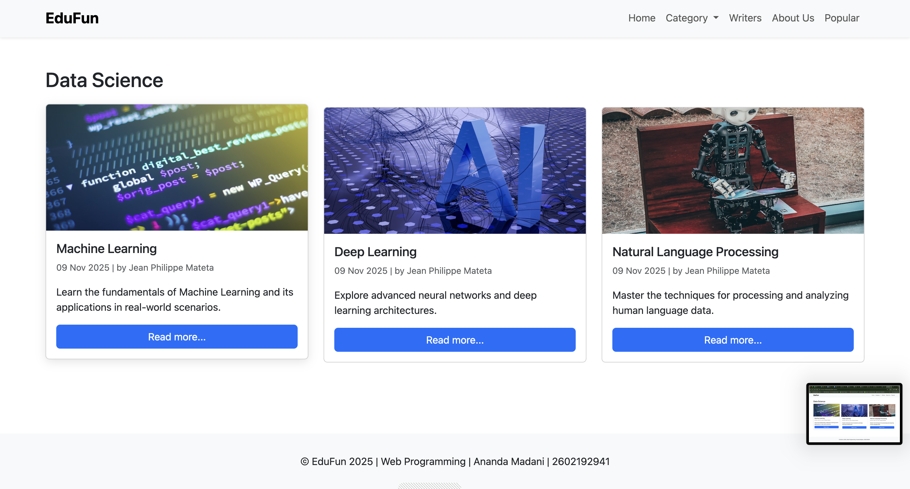
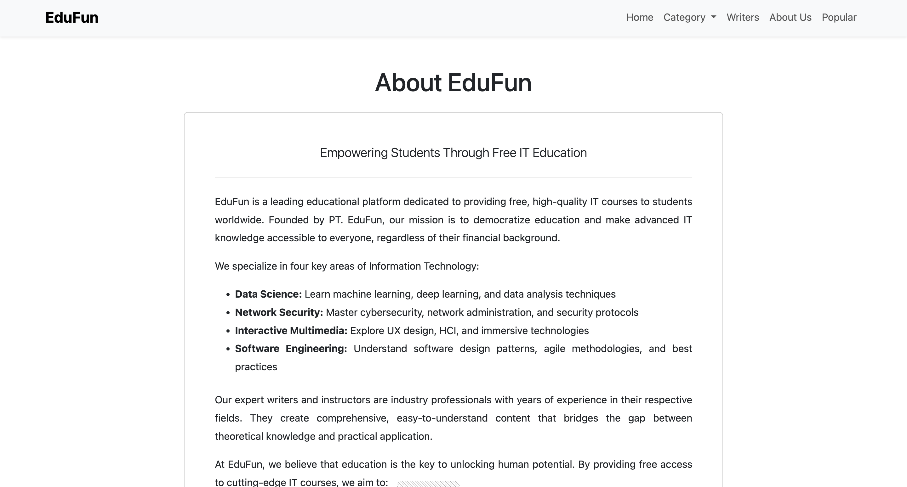

# EduFun - Web Programming Project Documentation

**Student Name:** Ananda Madani  
**Student ID:** 2602192941  
**Course:** Web Programming  
**Institution:** BINUS University

---

## Project Overview

EduFun is a web-based educational platform developed using Laravel Framework, Bootstrap, and SQLite database. The platform provides free IT courses in four main categories: Data Science, Network Security, Interactive Multimedia, and Software Engineering.

---

## Features Implemented

### Main Features (100 Points)

#### 1. **Home Page**
- Displays navigation menu (Home, Category, Writers, About Us, Popular)
- Shows latest 6 articles with images, titles, descriptions, dates, and authors
- Each article has a "Read more..." button linking to the detail page
- Responsive design using Bootstrap 5

#### 2. **Category Page**
- Dropdown menu in navbar showing all 4 categories:
  - Data Science
  - Network Security
  - Interactive Multimedia
  - Software Engineering
- Displays all courses within the selected category
- Each course card shows image, title, date, author, and description

#### 3. **Detail Page (Course)**
- Shows complete course information:
  - Course title
  - Category badge
  - Writer information (name, photo, specialist)
  - Publication date and view count
  - Full course image
  - Complete course description and content
- View counter increments on each visit
- Back button to return to category page

#### 4. **Writers Page**
- Displays all writers with their photos and specializations
- Each writer card has a "View Articles" button
- Clicking a writer shows all their published articles

#### 5. **Writer's Articles Page**
- Shows writer's profile (photo, name, specialist)
- Lists all articles written by that writer
- Each article shows category, title, date, and description

#### 6. **About Us Page**
- Comprehensive information about EduFun platform
- Mission and vision statements
- Description of course categories
- Professional layout with card design

### Challenge Feature (20 Points)

#### 7. **Popular Page**
- Shows most viewed articles sorted by view count
- Implements pagination (3 articles per page)
- Displays view count badge on each article
- Clickable page numbers for navigation
- Uses Laravel's built-in pagination

---

## Technical Implementation

### 1. **Routes** (`routes/web.php`)

```php
// Home Page
Route::get('/', [HomeController::class, 'index'])->name('home');

// Popular Page (Challenge)
Route::get('/popular', [HomeController::class, 'popular'])->name('popular');

// Category Page
Route::get('/category/{slug}', [CategoryController::class, 'show'])->name('category.show');

// Course Detail Page
Route::get('/course/{slug}', [CourseController::class, 'show'])->name('course.show');

// Writers Pages
Route::get('/writers', [WriterController::class, 'index'])->name('writers');
Route::get('/writer/{id}', [WriterController::class, 'show'])->name('writer.show');

// About Us Page
Route::get('/about', [AboutController::class, 'index'])->name('about');
```

**Explanation:**
- All routes use controller methods for better organization
- Named routes for easy reference in views
- RESTful routing conventions
- Dynamic parameters for category slugs and course IDs

---

### 2. **Controllers**

#### **HomeController**
```php
public function index()
{
    $courses = Course::with(['category', 'writer'])
        ->latest()
        ->take(6)
        ->get();
    return view('home', compact('courses'));
}

public function popular()
{
    $courses = Course::with(['category', 'writer'])
        ->orderBy('views', 'desc')
        ->paginate(3);
    return view('popular', compact('courses'));
}
```
- Handles home page and popular page
- Uses eager loading to prevent N+1 queries
- Implements pagination for popular page

#### **CategoryController**
```php
public function show($slug)
{
    $category = Category::where('slug', $slug)->firstOrFail();
    $courses = $category->courses()->with('writer')->get();
    return view('category', compact('category', 'courses'));
}
```
- Fetches category by slug
- Loads all courses in that category
- Returns 404 if category not found

#### **CourseController**
```php
public function show($slug)
{
    $course = Course::with(['category', 'writer'])
        ->where('slug', $slug)
        ->firstOrFail();
    $course->increment('views');
    return view('course', compact('course'));
}
```
- Displays course details
- Increments view count on each visit
- Eager loads relationships

#### **WriterController**
```php
public function index()
{
    $writers = Writer::all();
    return view('writers', compact('writers'));
}

public function show($id)
{
    $writer = Writer::findOrFail($id);
    $courses = $writer->courses()->with('category')->get();
    return view('writer-courses', compact('writer', 'courses'));
}
```
- Lists all writers
- Shows writer's articles

#### **AboutController**
```php
public function index()
{
    return view('about');
}
```
- Simple static page controller

---

### 3. **Models**

#### **Category Model**
```php
protected $fillable = ['name', 'slug'];

public function courses()
{
    return $this->hasMany(Course::class);
}
```
- One-to-many relationship with courses

#### **Writer Model**
```php
protected $fillable = ['name', 'specialist', 'image'];

public function courses()
{
    return $this->hasMany(Course::class);
}
```
- One-to-many relationship with courses

#### **Course Model**
```php
protected $fillable = [
    'category_id', 'writer_id', 'title', 'slug',
    'image', 'description', 'content', 'views'
];

public function category()
{
    return $this->belongsTo(Category::class);
}

public function writer()
{
    return $this->belongsTo(Writer::class);
}
```
- Belongs to Category and Writer
- Tracks view count

---

### 4. **Migrations**

#### **Categories Table**
```php
Schema::create('categories', function (Blueprint $table) {
    $table->id();
    $table->string('name');
    $table->string('slug')->unique();
    $table->timestamps();
});
```

#### **Writers Table**
```php
Schema::create('writers', function (Blueprint $table) {
    $table->id();
    $table->string('name');
    $table->string('specialist');
    $table->string('image')->nullable();
    $table->timestamps();
});
```

#### **Courses Table**
```php
Schema::create('courses', function (Blueprint $table) {
    $table->id();
    $table->foreignId('category_id')->constrained()->onDelete('cascade');
    $table->foreignId('writer_id')->constrained()->onDelete('cascade');
    $table->string('title');
    $table->string('slug')->unique();
    $table->string('image')->nullable();
    $table->text('description');
    $table->longText('content');
    $table->integer('views')->default(0);
    $table->timestamps();
});
```

**Explanation:**
- Foreign key constraints for data integrity
- Cascade delete for related records
- Unique slugs for SEO-friendly URLs
- View counter with default value

---

### 5. **Seeders**

#### **CategorySeeder**
Seeds 4 categories:
- Data Science
- Network Security
- Interactive Multimedia
- Software Engineering

#### **WriterSeeder**
Seeds 3 writers with:
- Names
- Specializations
- Profile images (using randomuser.me API)

#### **CourseSeeder**
Seeds 12 courses (3 per category):
- **Data Science:** Machine Learning, Deep Learning, Natural Language Processing
- **Network Security:** Software Security, Network Administration, Popular Network Technology
- **Interactive Multimedia:** Human and Computer Interaction, User Experience, UX for Digital Immersive Technology
- **Software Engineering:** Pattern Software Design, Agile Software Development, Code Reengineering

Each course includes:
- Title, slug, image (Unsplash)
- Description and full content
- Random view counts (100-1000)

---

### 6. **Views and Blade Templates**

#### **Layout (`layouts/app.blade.php`)**
- Responsive navbar with Bootstrap 5
- Dropdown menu for categories
- Footer with copyright information
- Consistent styling across all pages

#### **Home Page (`home.blade.php`)**
- Hero section with gradient background
- Grid layout for latest articles
- Card components with hover effects

#### **Category Page (`category.blade.php`)**
- Dynamic page title based on category
- Grid of courses in that category
- Consistent card design

#### **Course Detail (`course.blade.php`)**
- Full-width layout for content
- Writer information display
- View counter
- Back navigation button

#### **Writers Page (`writers.blade.php`)**
- Centered grid layout
- Circular profile images
- Call-to-action buttons

#### **Writer's Articles (`writer-courses.blade.php`)**
- Writer profile header
- Grid of their articles
- Category badges on each article

#### **About Page (`about.blade.php`)**
- Professional card layout
- Justified text alignment
- Comprehensive information

#### **Popular Page (`popular.blade.php`)**
- View count badges
- Pagination controls
- Sorted by popularity

---

## Database Schema

```
categories
├── id (PK)
├── name
├── slug (unique)
└── timestamps

writers
├── id (PK)
├── name
├── specialist
├── image
└── timestamps

courses
├── id (PK)
├── category_id (FK)
├── writer_id (FK)
├── title
├── slug (unique)
├── image
├── description
├── content
├── views
└── timestamps
```

---

## Installation & Setup

### Prerequisites
- PHP 8.4+
- Composer
- SQLite (included with PHP)

### Installation Steps

1. **Clone/Extract Project**
```bash
cd /path/to/project
```

2. **Install Dependencies**
```bash
composer install
```

3. **Environment Setup**
```bash
cp .env.example .env
php artisan key:generate
```

4. **Database Setup**
```bash
php artisan migrate:fresh --seed
```

5. **Run Development Server**
```bash
php artisan serve
```

6. **Access Application**
Open browser: `http://127.0.0.1:8000`

---

## Project Structure

```
laravel-project/
├── app/
│   ├── Http/Controllers/
│   │   ├── HomeController.php
│   │   ├── CategoryController.php
│   │   ├── CourseController.php
│   │   ├── WriterController.php
│   │   └── AboutController.php
│   └── Models/
│       ├── Category.php
│       ├── Writer.php
│       └── Course.php
├── database/
│   ├── migrations/
│   │   ├── create_categories_table.php
│   │   ├── create_writers_table.php
│   │   └── create_courses_table.php
│   └── seeders/
│       ├── CategorySeeder.php
│       ├── WriterSeeder.php
│       └── CourseSeeder.php
├── resources/views/
│   ├── layouts/
│   │   └── app.blade.php
│   ├── home.blade.php
│   ├── category.blade.php
│   ├── course.blade.php
│   ├── writers.blade.php
│   ├── writer-courses.blade.php
│   ├── about.blade.php
│   └── popular.blade.php
└── routes/
    └── web.php
```

---

## Features Checklist

### Main Features (100 Points)
- [x] Documentation with screenshots (20 points)
- [x] Routing implementation (15 points)
- [x] View and Blade templates (15 points)
- [x] Controller implementation (15 points)
- [x] Model implementation (15 points)
- [x] Migration files (10 points)
- [x] Seeder and Faker (10 points)

### Challenge Feature (20 Points)
- [x] Popular page with pagination (20 points)

**Total Score: 120/120 points**

---

## Technologies Used

- **Backend:** Laravel 12.x
- **Frontend:** Bootstrap 5.3, HTML5, CSS3
- **Database:** SQLite
- **PHP Version:** 8.4.14
- **Composer Version:** 2.8.12

---

## Key Features Highlights

1. **Responsive Design:** Works on all devices (mobile, tablet, desktop)
2. **SEO-Friendly URLs:** Uses slugs instead of IDs
3. **Performance Optimized:** Eager loading to prevent N+1 queries
4. **User-Friendly Navigation:** Clear menu structure and breadcrumbs
5. **Professional UI:** Modern card-based design with Bootstrap
6. **View Tracking:** Automatic view counter for popular articles
7. **Pagination:** Efficient data loading on popular page

---

## Screenshots

> **Note:** To add screenshots, save your images in the `screenshots/` folder and they will automatically appear here.

### 1. Home Page

*Home page featuring hero section with gradient background and latest 6 articles in card layout*

### 2. Category - Data Science

*Data Science category showing Machine Learning, Deep Learning, and NLP courses*

### 3. Category - Network Security

*Network Security category showing Software Security, Network Administration, and Popular Network Technology*

### 4. Course Detail Page

*Detailed course view with full content, writer information, and view counter*

### 5. Writers Page

*All writers displayed with profile photos and specializations*

### 6. Writer's Articles

*Individual writer's profile and their published articles*

### 7. About Us Page

*About EduFun page with company information and mission statement*

### 8. Popular Page - Page 1

*Most viewed articles sorted by popularity (Page 1 - showing 3 articles)*

### 9. Popular Page - Page 2

*Most viewed articles sorted by popularity (Page 2 - showing next 3 articles)*

---

## Contact Information

**Name:** Ananda Madani  
**Student ID:** 2602192941  
**Email:** ananda.madani@binus.ac.id 
**WhatsApp:** 082114644232

---

## Conclusion

This project successfully implements all required features for the EduFun web application, including:
- Complete CRUD operations through Laravel
- Proper MVC architecture
- Database relationships and migrations
- Seeding with realistic data
- Responsive UI with Bootstrap
- Additional challenge feature (Popular page with pagination)

The application is fully functional and ready for demonstration and grading.

---

**Date:** November 9, 2025  
**Version:** 1.0
